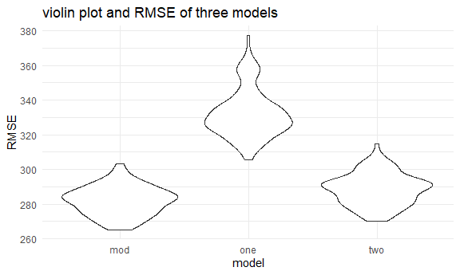

p8105\_hw6\_zw2709
================

``` r
library(tidyverse)
```

    ## -- Attaching packages ------------------------------------------------------ tidyverse 1.3.0 --

    ## √ ggplot2 3.3.2     √ purrr   0.3.4
    ## √ tibble  3.0.3     √ dplyr   1.0.2
    ## √ tidyr   1.1.2     √ stringr 1.4.0
    ## √ readr   1.3.1     √ forcats 0.5.0

    ## Warning: package 'dplyr' was built under R version 4.0.3

    ## -- Conflicts --------------------------------------------------------- tidyverse_conflicts() --
    ## x dplyr::filter() masks stats::filter()
    ## x dplyr::lag()    masks stats::lag()

``` r
library(modelr)
library(mgcv)
```

    ## Loading required package: nlme

    ## 
    ## Attaching package: 'nlme'

    ## The following object is masked from 'package:dplyr':
    ## 
    ##     collapse

    ## This is mgcv 1.8-33. For overview type 'help("mgcv-package")'.

``` r
knitr::opts_chunk$set(
  fig.width = 6,
  fig.asp = 0.6,
  out.width = '90%'
)
theme_set(theme_minimal()+ theme(legend.position = 'bottom'))

options(
  ggplot2.continuous.colour = 'viridis',
  ggplot2.continuous.fill = 'viridis'
)

scale_colour_discrete = scale_color_viridis_d
scale_fill_discrete = scale_fill_viridis_d

set.seed(1)
```

### Problem 1

``` r
homicide_df = 
  read_csv("data/homicide.csv", na = c("", "NA", "Unknown")) %>% 
  mutate(
    city_state = str_c(city, state, sep = ", "),
    victim_age = as.numeric(victim_age),
    resolution = case_when(
      disposition == "Closed without arrest" ~ 0,
      disposition == "Open/No arrest"        ~ 0,
      disposition == "Closed by arrest"      ~ 1)
  ) %>% 
  filter(
    victim_race %in% c("White", "Black"),
    city_state != "Tulsa, AL") %>% 
  select(city_state, resolution, victim_age, victim_race, victim_sex)
```

    ## Parsed with column specification:
    ## cols(
    ##   uid = col_character(),
    ##   reported_date = col_double(),
    ##   victim_last = col_character(),
    ##   victim_first = col_character(),
    ##   victim_race = col_character(),
    ##   victim_age = col_double(),
    ##   victim_sex = col_character(),
    ##   city = col_character(),
    ##   state = col_character(),
    ##   lat = col_double(),
    ##   lon = col_double(),
    ##   disposition = col_character()
    ## )

Start with one city.

``` r
baltimore_df =
  homicide_df %>% 
  filter(city_state == "Baltimore, MD")
glm(resolution ~ victim_age + victim_race + victim_sex, 
    data = baltimore_df,
    family = binomial()) %>% 
  broom::tidy() %>% 
  mutate(
    OR = exp(estimate),
    CI_lower = exp(estimate - 1.96 * std.error),
    CI_upper = exp(estimate + 1.96 * std.error)
  ) %>% 
  select(term, OR, starts_with("CI")) %>% 
  knitr::kable(digits = 3)
```

| term              |    OR | CI\_lower | CI\_upper |
| :---------------- | ----: | --------: | --------: |
| (Intercept)       | 1.363 |     0.975 |     1.907 |
| victim\_age       | 0.993 |     0.987 |     1.000 |
| victim\_raceWhite | 2.320 |     1.648 |     3.268 |
| victim\_sexMale   | 0.426 |     0.325 |     0.558 |

Try this across cities.

``` r
models_results_df = 
  homicide_df %>% 
  nest(data = -city_state) %>% 
  mutate(
    models = 
      map(.x = data, ~glm(resolution ~ victim_age + victim_race + victim_sex, data = .x, family = binomial())),
    results = map(models, broom::tidy)
  ) %>% 
  select(city_state, results) %>% 
  unnest(results) %>% 
  mutate(
    OR = exp(estimate),
    CI_lower = exp(estimate - 1.96 * std.error),
    CI_upper = exp(estimate + 1.96 * std.error)
  ) %>% 
  select(city_state, term, OR, starts_with("CI")) 
```

``` r
models_results_df %>% 
  filter(term == "victim_sexMale") %>% 
  mutate(city_state = fct_reorder(city_state, OR)) %>% 
  ggplot(aes(x = city_state, y = OR)) + 
  geom_point() + 
  geom_errorbar(aes(ymin = CI_lower, ymax = CI_upper)) + 
  theme(axis.text.x = element_text(angle = 90, hjust = 1))
```


## Problem 2

Find some residuals

``` r
baby_df = 
  read_csv("./data/birthweight.csv") %>% 
  janitor::clean_names() %>% 
  
  #convert numeric to factor
  mutate(
    babysex = case_when(
      babysex == 1 ~ "Male",
      babysex == 2 ~ "Female"),
    babysex = as.factor(babysex),
    frace = case_when(
      frace == 1 ~ "White",
      frace == 2 ~ "Black",
      frace == 3 ~ "Asian",
      frace == 4 ~ "Puerto Rican",
      frace == 8 ~ "Other"),
    frace = as.factor(frace),
    malform = case_when(
      malform == 0 ~ "absent",
      malform == 1 ~ "present"),
    malform = as.factor(malform),
    mrace = case_when(
      mrace == 1 ~ "White",
      mrace == 2 ~ "Black",
      mrace == 3 ~ "Asian",
      mrace == 4 ~ "Puerto Rican",
      mrace == 8 ~ "Other"),
    mrace = as.factor(mrace)
    
  )
```

    ## Parsed with column specification:
    ## cols(
    ##   .default = col_double()
    ## )

    ## See spec(...) for full column specifications.

    ## Warning in FUN(X[[i]], ...): strings not representable in native encoding will
    ## be translated to UTF-8

    ## Warning in FUN(X[[i]], ...): unable to translate '<U+00C4>' to native encoding

    ## Warning in FUN(X[[i]], ...): unable to translate '<U+00D6>' to native encoding

    ## Warning in FUN(X[[i]], ...): unable to translate '<U+00E4>' to native encoding

    ## Warning in FUN(X[[i]], ...): unable to translate '<U+00F6>' to native encoding

    ## Warning in FUN(X[[i]], ...): unable to translate '<U+00DF>' to native encoding

    ## Warning in FUN(X[[i]], ...): unable to translate '<U+00C6>' to native encoding

    ## Warning in FUN(X[[i]], ...): unable to translate '<U+00E6>' to native encoding

    ## Warning in FUN(X[[i]], ...): unable to translate '<U+00D8>' to native encoding

    ## Warning in FUN(X[[i]], ...): unable to translate '<U+00F8>' to native encoding

    ## Warning in FUN(X[[i]], ...): unable to translate '<U+00C5>' to native encoding

    ## Warning in FUN(X[[i]], ...): unable to translate '<U+00E5>' to native encoding

There seems to have no missing data in the baby\_df, and we could
analyze the data using 4342 observations.

## fit a model

try to use linear regression model using all possible predictors and
check the p value

``` r
all_fit = lm(bwt ~ ., data = baby_df)
summary(all_fit)
```

    ## 
    ## Call:
    ## lm(formula = bwt ~ ., data = baby_df)
    ## 
    ## Residuals:
    ##      Min       1Q   Median       3Q      Max 
    ## -1097.68  -184.86    -3.33   173.09  2344.15 
    ## 
    ## Coefficients: (3 not defined because of singularities)
    ##                     Estimate Std. Error t value Pr(>|t|)    
    ## (Intercept)       -6306.8346   659.2640  -9.566  < 2e-16 ***
    ## babysexMale         -28.7073     8.4652  -3.391 0.000702 ***
    ## bhead               130.7781     3.4523  37.881  < 2e-16 ***
    ## blength              74.9536     2.0217  37.075  < 2e-16 ***
    ## delwt                 4.1007     0.3948  10.386  < 2e-16 ***
    ## fincome               0.2898     0.1795   1.614 0.106551    
    ## fraceBlack           -6.9048    78.8349  -0.088 0.930210    
    ## fraceOther          -16.9392    97.5932  -0.174 0.862212    
    ## fracePuerto Rican   -68.2323    78.4692  -0.870 0.384599    
    ## fraceWhite          -21.2361    69.2960  -0.306 0.759273    
    ## gaweeks              11.5494     1.4654   7.882 4.06e-15 ***
    ## malformpresent        9.7650    70.6259   0.138 0.890039    
    ## menarche             -3.5508     2.8951  -1.226 0.220083    
    ## mheight               9.7874    10.3116   0.949 0.342588    
    ## momage                0.7593     1.2221   0.621 0.534418    
    ## mraceBlack          -60.0488    80.9532  -0.742 0.458266    
    ## mracePuerto Rican    34.9079    80.9481   0.431 0.666317    
    ## mraceWhite           91.3866    71.9190   1.271 0.203908    
    ## parity               95.5411    40.4793   2.360 0.018307 *  
    ## pnumlbw                   NA         NA      NA       NA    
    ## pnumsga                   NA         NA      NA       NA    
    ## ppbmi                 4.3538    14.8913   0.292 0.770017    
    ## ppwt                 -3.4716     2.6121  -1.329 0.183913    
    ## smoken               -4.8544     0.5871  -8.269  < 2e-16 ***
    ## wtgain                    NA         NA      NA       NA    
    ## ---
    ## Signif. codes:  0 '***' 0.001 '**' 0.01 '*' 0.05 '.' 0.1 ' ' 1
    ## 
    ## Residual standard error: 272.5 on 4320 degrees of freedom
    ## Multiple R-squared:  0.7183, Adjusted R-squared:  0.717 
    ## F-statistic: 524.6 on 21 and 4320 DF,  p-value: < 2.2e-16

And we might choose the model with predictors which is significant at 5%
significance level, meaning the corresponding p value is less than 0.05

bwt \~ babysex + bhead + blength + delwt + gaweeks + parity + smoken

Therefore the fitted model and its information are as follows:

``` r
mod_fit = lm(bwt ~ babysex + bhead + blength + delwt + gaweeks + parity + smoken, data = baby_df)

broom::tidy(mod_fit) %>% 
  knitr::kable(digits = 3)
```

| term        |   estimate | std.error | statistic | p.value |
| :---------- | ---------: | --------: | --------: | ------: |
| (Intercept) | \-6264.283 |    95.817 |  \-65.377 |   0.000 |
| babysexMale |   \-29.760 |     8.732 |   \-3.408 |   0.001 |
| bhead       |    137.024 |     3.534 |    38.773 |   0.000 |
| blength     |     78.868 |     2.071 |    38.083 |   0.000 |
| delwt       |      2.074 |     0.199 |    10.411 |   0.000 |
| gaweeks     |     14.357 |     1.501 |     9.564 |   0.000 |
| parity      |    102.302 |    41.713 |     2.453 |   0.014 |
| smoken      |    \-2.169 |     0.582 |   \-3.727 |   0.000 |

Then we need to make the plot based on the model residuals against the
fitted values

Treat the residuals as y values and the predictions as x values

``` r
baby_df %>% 
  add_predictions(mod_fit) %>% 
  add_residuals(mod_fit) %>% 
  ggplot(aes(x = pred, y = resid)) + 
  geom_point(alpha = 0.3)+
  geom_smooth(method = "lm")
```

    ## `geom_smooth()` using formula 'y ~ x'


The residuals bounce around 0 and it seems to form a horizontal line
around 0.

## Compare to two other models

  - Model 1

bwt \~ blength + gaweeks

``` r
one_fit = lm(bwt ~ blength + gaweeks, data = baby_df)

broom::tidy(one_fit) %>% 
  knitr::kable(digits = 3)
```

| term        |   estimate | std.error | statistic | p.value |
| :---------- | ---------: | --------: | --------: | ------: |
| (Intercept) | \-4347.667 |    97.958 |  \-44.383 |       0 |
| blength     |    128.556 |     1.990 |    64.604 |       0 |
| gaweeks     |     27.047 |     1.718 |    15.744 |       0 |

  - Model 2

bwt \~ bhead + blength + babysex + bhead \* blength + bhead \* babysex +
blength \* babysex + bhead \* blength \* babysex

``` r
two_fit = lm(bwt ~ bhead + blength + babysex + bhead * blength + bhead * babysex + blength * babysex + bhead * blength * babysex, data = baby_df)

broom::tidy(two_fit) %>% 
  knitr::kable(digits = 3)
```

| term                      |   estimate | std.error | statistic | p.value |
| :------------------------ | ---------: | --------: | --------: | ------: |
| (Intercept)               |  \-801.949 |  1102.308 |   \-0.728 |   0.467 |
| bhead                     |   \-16.598 |    34.092 |   \-0.487 |   0.626 |
| blength                   |   \-21.646 |    23.372 |   \-0.926 |   0.354 |
| babysexMale               | \-6374.868 |  1677.767 |   \-3.800 |   0.000 |
| bhead:blength             |      3.324 |     0.713 |     4.666 |   0.000 |
| bhead:babysexMale         |    198.393 |    51.092 |     3.883 |   0.000 |
| blength:babysexMale       |    123.773 |    35.119 |     3.524 |   0.000 |
| bhead:blength:babysexMale |    \-3.878 |     1.057 |   \-3.670 |   0.000 |

Cross validation

``` r
cv_df = 
  crossv_mc(baby_df, 100) %>% 
  mutate(
    train = map(train, as_tibble), 
    test = map(test, as_tibble)
  )
```

``` r
cv_df = 
  cv_df %>% 
  mutate(
    mod_fit = map(.x = train, ~lm(bwt~ babysex + bhead + blength + delwt + gaweeks + parity + smoken, data = .x)),
    one_fit = map(.x = train, ~lm(bwt ~ blength + gaweeks, data = .x)),
    two_fit = map(.x = train, ~lm(bwt ~ bhead + blength + babysex + bhead * blength + bhead * babysex + blength * babysex + bhead * blength * babysex, data = .x))
    
  ) %>% 
  mutate(
    rmse_mod = map2_dbl(.x = mod_fit, .y = test, ~rmse(model = .x, data = .y)),
    rmse_one = map2_dbl(.x = one_fit, .y = test, ~rmse(model = .x, data = .y)),
    rmse_two = map2_dbl(.x = two_fit, .y = test, ~rmse(model = .x, data = .y))
  )
```

    ## Warning: Problem with `mutate()` input `rmse_mod`.
    ## i prediction from a rank-deficient fit may be misleading
    ## i Input `rmse_mod` is `map2_dbl(.x = mod_fit, .y = test, ~rmse(model = .x, data = .y))`.

    ## Warning in predict.lm(model, data): prediction from a rank-deficient fit may be
    ## misleading

``` r
cv_df %>% 
  select(starts_with("rmse")) %>% 
  pivot_longer(
    everything(),
    names_to = "model",
    values_to = "rmse",
    names_prefix = "rmse_"
  ) %>% 
  
  ggplot(aes(x = model, y = rmse)) +
  geom_violin()
```



``` r
cv_df %>% 
  select(starts_with("rmse")) %>% 
  pivot_longer(
    everything(),
    names_to = "model",
    values_to = "rmse",
    names_prefix = "rmse_"
  ) %>% 
  group_by(model) %>% 
  summarize(avg_rmse = mean(rmse))
```

    ## `summarise()` ungrouping output (override with `.groups` argument)

    ## # A tibble: 3 x 2
    ##   model avg_rmse
    ##   <chr>    <dbl>
    ## 1 mod       282.
    ## 2 one       332.
    ## 3 two       289.

The RMSE of model 1 is the largest, so it is not good fit because of
large errors. The model 2 and mod\_fit has similar RMSE but mod\_fit has
smaller RMSE, so mod\_fit would be the best model fit among the three
ones.
